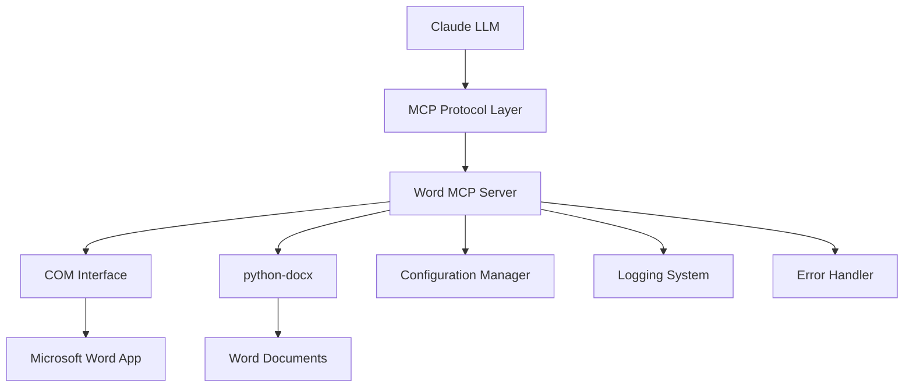

# Design Document

## Overview

The Word Office MCP Server is a Python-based Model Context Protocol server that enables LLMs like Claude to interact with Microsoft Word applications. The server acts as a bridge, translating natural language commands from Claude into Word automation operations using COM (Component Object Model) interfaces and python-docx library.

The architecture follows the MCP specification, providing tools and resources that Claude can invoke to perform document operations. The server handles both direct Word application control (via COM) and document file manipulation (via python-docx) to provide comprehensive Word functionality.

## Architecture



### Core Components

1. **MCP Server Core**: Handles MCP protocol communication and tool registration
2. **Word COM Controller**: Manages direct interaction with Word application via COM
3. **Document Manager**: Handles file operations using python-docx
4. **Command Processor**: Translates LLM requests into Word operations
5. **Error Handler**: Provides graceful error handling and recovery
6. **Configuration Manager**: Manages server settings and Word preferences

## Components and Interfaces

### MCP Server Interface

```python
class WordMCPServer:
    """Main MCP server class implementing the MCP protocol"""
    
    async def handle_initialize(self, params)
    async def handle_list_tools(self)
    async def handle_call_tool(self, name, arguments)
    async def handle_list_resources(self)
    async def handle_read_resource(self, uri)
```

### Word Controller Interface

```python
class WordController:
    """Handles direct Word application control via COM"""
    
    def connect_to_word(self) -> bool
    def create_document(self) -> str
    def open_document(self, path: str) -> str
    def save_document(self, doc_id: str, path: str = None)
    def insert_text(self, doc_id: str, text: str, position: int = None)
    def format_text(self, doc_id: str, start: int, end: int, **formatting)
    def create_table(self, doc_id: str, rows: int, cols: int)
    def find_replace(self, doc_id: str, find_text: str, replace_text: str)
```

### Document Manager Interface

```python
class DocumentManager:
    """Handles document operations using python-docx"""
    
    def read_document(self, path: str) -> dict
    def extract_text(self, path: str) -> str
    def get_document_info(self, path: str) -> dict
    def extract_tables(self, path: str) -> list
    def get_document_structure(self, path: str) -> dict
```

### MCP Tools Available to Claude

1. **create_document**: Create a new Word document
2. **open_document**: Open an existing document
3. **save_document**: Save document to specified location
4. **insert_text**: Insert text at specified position
5. **format_text**: Apply formatting to text ranges
6. **create_table**: Create tables with specified dimensions
7. **insert_list**: Create bulleted or numbered lists
8. **find_replace**: Find and replace text
9. **read_document**: Extract text and content from documents
10. **get_document_info**: Get metadata and statistics
11. **insert_header_footer**: Add headers and footers
12. **export_document**: Export to different formats

## Data Models

### Document Reference Model

```python
@dataclass
class DocumentReference:
    doc_id: str
    file_path: Optional[str]
    title: str
    is_active: bool
    word_app_ref: Optional[object]  # COM object reference
    created_at: datetime
    last_modified: datetime
```

### Operation Result Model

```python
@dataclass
class OperationResult:
    success: bool
    message: str
    data: Optional[dict] = None
    error_code: Optional[str] = None
    doc_id: Optional[str] = None
```

### Text Formatting Model

```python
@dataclass
class TextFormatting:
    bold: Optional[bool] = None
    italic: Optional[bool] = None
    underline: Optional[bool] = None
    font_name: Optional[str] = None
    font_size: Optional[int] = None
    color: Optional[str] = None
    highlight_color: Optional[str] = None
```

## Error Handling

### Error Categories

1. **Connection Errors**: Word application not available or COM failures
2. **Document Errors**: File not found, access denied, corrupted files
3. **Operation Errors**: Invalid parameters, unsupported operations
4. **MCP Protocol Errors**: Invalid tool calls, malformed requests

### Error Recovery Strategies

1. **Word Application Recovery**: Attempt to restart Word if connection is lost
2. **Document Recovery**: Try alternative access methods (COM vs python-docx)
3. **Graceful Degradation**: Fall back to read-only operations if write fails
4. **Retry Logic**: Implement exponential backoff for transient failures

### Error Response Format

```python
{
    "error": {
        "code": "WORD_CONNECTION_FAILED",
        "message": "Could not connect to Microsoft Word application",
        "details": "Word may not be installed or COM interface is unavailable",
        "suggestions": ["Install Microsoft Word", "Run as administrator", "Check COM registration"]
    }
}
```

## Testing Strategy

### Unit Testing

1. **MCP Protocol Tests**: Verify correct MCP message handling
2. **Word Controller Tests**: Mock COM interfaces for Word operations
3. **Document Manager Tests**: Test python-docx operations with sample files
4. **Error Handler Tests**: Verify error scenarios and recovery

### Integration Testing

1. **End-to-End Tests**: Full workflow from Claude command to Word operation
2. **Word Application Tests**: Real Word application integration (requires Word installed)
3. **File System Tests**: Document creation, modification, and saving
4. **Concurrent Operation Tests**: Multiple simultaneous document operations

### Test Environment Setup

1. **Mock Word Environment**: Use mock COM objects for CI/CD
2. **Real Word Environment**: Windows environment with Word installed
3. **Sample Documents**: Test files with various content types
4. **Claude Integration Tests**: Actual MCP protocol communication

### Performance Testing

1. **Large Document Handling**: Test with documents containing thousands of pages
2. **Concurrent User Simulation**: Multiple Claude instances using the server
3. **Memory Usage Monitoring**: Ensure no memory leaks with long-running operations
4. **Response Time Benchmarks**: Measure operation completion times

## Security Considerations

### COM Security

1. **Application Isolation**: Run Word in separate process space
2. **Permission Validation**: Verify file access permissions before operations
3. **Macro Security**: Disable or restrict macro execution
4. **Process Monitoring**: Monitor Word process health and resource usage

### File System Security

1. **Path Validation**: Sanitize and validate all file paths
2. **Access Control**: Respect file system permissions
3. **Temporary Files**: Secure handling of temporary documents
4. **Backup Strategy**: Create backups before destructive operations

## Configuration

### Server Configuration

```yaml
server:
  host: "localhost"
  port: 8080
  max_concurrent_docs: 10
  timeout_seconds: 30
  
word:
  auto_launch: true
  visible: false
  save_on_exit: true
  backup_enabled: true
  
logging:
  level: "INFO"
  file: "word_mcp_server.log"
  max_size_mb: 100
  
security:
  allowed_paths: ["~/Documents", "~/Desktop"]
  enable_macros: false
  max_file_size_mb: 50
```

### Claude Integration Setup

The server will be configured as an MCP server in Claude's configuration:

```json
{
  "mcpServers": {
    "word-office": {
      "command": "python",
      "args": ["-m", "word_mcp_server"],
      "env": {
        "WORD_MCP_CONFIG": "config.yaml"
      }
    }
  }
}
```

## Deployment Architecture

### Local Development

1. **Python Environment**: Virtual environment with required packages
2. **Word Installation**: Microsoft Word 2016 or later
3. **COM Registration**: Ensure Word COM interfaces are registered
4. **Configuration Files**: Local config for development settings

### Production Deployment

1. **Windows Server**: Windows environment with Word installed
2. **Service Mode**: Run as Windows service for reliability
3. **Monitoring**: Health checks and performance monitoring
4. **Logging**: Centralized logging for troubleshooting

### Package Distribution

1. **PyPI Package**: Distribute via Python Package Index
2. **Dependencies**: Automatic installation of required packages
3. **Setup Script**: Automated configuration and COM registration
4. **Documentation**: Comprehensive setup and usage guides