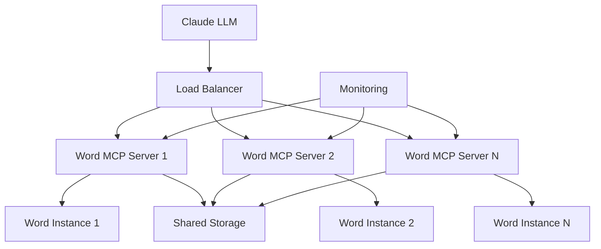

# Deployment Guide

This guide covers various deployment scenarios for Word MCP Server in production environments.

## Deployment Architecture



## Deployment Scenarios

### 1. Single User Desktop

**Use Case**: Individual developer or user
**Requirements**: Local Word installation, single Claude instance

```yaml
# config.yaml
server:
  host: "localhost"
  port: 8080
  max_concurrent_docs: 5

word:
  auto_launch: true
  visible: false
  
security:
  allowed_paths:
    - "~/Documents"
    - "~/Desktop"
```

**Deployment Steps**:
1. Install via pip: `pip install word-mcp-server`
2. Create config: `word-mcp-server --create-config`
3. Start server: `word-mcp-server`
4. Configure Claude MCP settings

### 2. Team Development Environment

**Use Case**: Development team with shared resources
**Requirements**: Multiple users, shared document storage

```yaml
# config.yaml
server:
  host: "0.0.0.0"  # Allow network access
  port: 8080
  max_concurrent_docs: 20

word:
  auto_launch: true
  visible: false
  save_on_exit: true
  backup_enabled: true

security:
  allowed_paths:
    - "//shared-server/documents"
    - "//shared-server/templates"
  max_file_size_mb: 100

logging:
  level: "INFO"
  file: "//shared-server/logs/word_mcp_server.log"
```

**Deployment Steps**:
1. Install on Windows server with Word
2. Configure shared storage access
3. Set up Windows service
4. Configure firewall rules
5. Set up monitoring

### 3. Enterprise Production

**Use Case**: Large organization with high availability requirements
**Requirements**: Load balancing, monitoring, backup, security

#### Load Balancer Configuration

```nginx
# nginx.conf
upstream word_mcp_servers {
    server 10.0.1.10:8080 weight=1;
    server 10.0.1.11:8080 weight=1;
    server 10.0.1.12:8080 weight=1;
}

server {
    listen 80;
    server_name word-mcp.company.com;
    
    location / {
        proxy_pass http://word_mcp_servers;
        proxy_set_header Host $host;
        proxy_set_header X-Real-IP $remote_addr;
        proxy_set_header X-Forwarded-For $proxy_add_x_forwarded_for;
        proxy_connect_timeout 30s;
        proxy_send_timeout 30s;
        proxy_read_timeout 30s;
    }
    
    location /health {
        proxy_pass http://word_mcp_servers/health;
        access_log off;
    }
}
```

#### Server Configuration

```yaml
# production-config.yaml
server:
  host: "0.0.0.0"
  port: 8080
  max_concurrent_docs: 50
  timeout_seconds: 60

word:
  auto_launch: true
  visible: false
  save_on_exit: true
  backup_enabled: true

logging:
  level: "WARNING"
  file: "/var/log/word-mcp-server/server.log"
  max_size_mb: 500

security:
  allowed_paths:
    - "/mnt/documents"
    - "/mnt/templates"
  enable_macros: false
  max_file_size_mb: 200

monitoring:
  enabled: true
  metrics_port: 9090
  health_check_interval: 30
```

## Windows Service Deployment

### Manual Service Installation

```batch
@echo off
REM install-service.bat

echo Installing Word MCP Server as Windows Service...

sc create WordMCPServer ^
  binPath= "C:\Python\Scripts\word-mcp-server.exe --config C:\WordMCP\config.yaml" ^
  DisplayName= "Word MCP Server" ^
  Description= "Model Context Protocol server for Microsoft Word automation" ^
  start= auto

sc config WordMCPServer depend= "Word Application"

echo Service installed successfully!
echo Starting service...
net start WordMCPServer

echo Service status:
sc query WordMCPServer
```

### PowerShell Service Management

```powershell
# service-management.ps1

function Install-WordMCPService {
    param(
        [string]$ConfigPath = "C:\WordMCP\config.yaml",
        [string]$ServiceName = "WordMCPServer"
    )
    
    $BinaryPath = "word-mcp-server --config $ConfigPath"
    
    New-Service -Name $ServiceName `
                -BinaryPathName $BinaryPath `
                -DisplayName "Word MCP Server" `
                -Description "MCP server for Word automation" `
                -StartupType Automatic
    
    Start-Service -Name $ServiceName
    Write-Host "Service installed and started successfully!"
}

function Remove-WordMCPService {
    param([string]$ServiceName = "WordMCPServer")
    
    Stop-Service -Name $ServiceName -Force
    Remove-Service -Name $ServiceName
    Write-Host "Service removed successfully!"
}

function Restart-WordMCPService {
    param([string]$ServiceName = "WordMCPServer")
    
    Restart-Service -Name $ServiceName
    Write-Host "Service restarted successfully!"
}
```

## Docker Deployment (Experimental)

### Dockerfile

```dockerfile
# Dockerfile
FROM mcr.microsoft.com/windows/servercore:ltsc2022

# Install Python
RUN powershell -Command \
    Invoke-WebRequest -Uri https://www.python.org/ftp/python/3.11.0/python-3.11.0-amd64.exe -OutFile python-installer.exe; \
    Start-Process python-installer.exe -ArgumentList '/quiet InstallAllUsers=1 PrependPath=1' -Wait; \
    Remove-Item python-installer.exe

# Install Word MCP Server
RUN pip install word-mcp-server

# Create app directory
WORKDIR /app

# Copy configuration
COPY config.yaml /app/config.yaml

# Create logs directory
RUN mkdir C:\logs

# Expose port
EXPOSE 8080

# Health check
HEALTHCHECK --interval=30s --timeout=10s --start-period=60s --retries=3 \
    CMD powershell -Command "try { Invoke-WebRequest -Uri http://localhost:8080/health -UseBasicParsing | Out-Null; exit 0 } catch { exit 1 }"

# Start server
CMD ["word-mcp-server", "--config", "/app/config.yaml"]
```

### Docker Compose

```yaml
# docker-compose.yml
version: '3.8'

services:
  word-mcp-server:
    build: .
    ports:
      - "8080:8080"
    volumes:
      - ./config.yaml:/app/config.yaml
      - ./logs:/logs
      - documents:/mnt/documents
    environment:
      - WORD_MCP_CONFIG=/app/config.yaml
    restart: unless-stopped
    healthcheck:
      test: ["CMD", "powershell", "-Command", "Invoke-WebRequest -Uri http://localhost:8080/health -UseBasicParsing"]
      interval: 30s
      timeout: 10s
      retries: 3
      start_period: 60s

  nginx:
    image: nginx:alpine
    ports:
      - "80:80"
    volumes:
      - ./nginx.conf:/etc/nginx/nginx.conf
    depends_on:
      - word-mcp-server
    restart: unless-stopped

volumes:
  documents:
    driver: local
```

## Monitoring and Observability

### Health Checks

```python
# health_check.py
import requests
import sys
import time

def check_health(url="http://localhost:8080/health", timeout=10):
    """Check server health."""
    try:
        response = requests.get(url, timeout=timeout)
        if response.status_code == 200:
            data = response.json()
            print(f"✓ Server healthy: {data}")
            return True
        else:
            print(f"✗ Server unhealthy: {response.status_code}")
            return False
    except Exception as e:
        print(f"✗ Health check failed: {e}")
        return False

if __name__ == "__main__":
    if not check_health():
        sys.exit(1)
```

### Prometheus Metrics

```yaml
# prometheus.yml
global:
  scrape_interval: 15s

scrape_configs:
  - job_name: 'word-mcp-server'
    static_configs:
      - targets: ['localhost:9090']
    metrics_path: /metrics
    scrape_interval: 30s
```

### Log Aggregation

```yaml
# filebeat.yml
filebeat.inputs:
- type: log
  enabled: true
  paths:
    - /var/log/word-mcp-server/*.log
  fields:
    service: word-mcp-server
    environment: production

output.elasticsearch:
  hosts: ["elasticsearch:9200"]

setup.kibana:
  host: "kibana:5601"
```

## Security Hardening

### Network Security

```yaml
# security-config.yaml
server:
  host: "127.0.0.1"  # Localhost only
  port: 8080
  ssl_enabled: true
  ssl_cert: "/etc/ssl/certs/server.crt"
  ssl_key: "/etc/ssl/private/server.key"

security:
  allowed_paths:
    - "/secure/documents"
  enable_macros: false
  max_file_size_mb: 50
  rate_limiting:
    enabled: true
    requests_per_minute: 60
  authentication:
    enabled: true
    api_key_required: true
```

### Firewall Configuration

```batch
REM Windows Firewall rules
netsh advfirewall firewall add rule name="Word MCP Server" dir=in action=allow protocol=TCP localport=8080
netsh advfirewall firewall add rule name="Word MCP Metrics" dir=in action=allow protocol=TCP localport=9090
```

## Backup and Recovery

### Automated Backup Script

```powershell
# backup.ps1
param(
    [string]$BackupPath = "C:\Backups\WordMCP",
    [int]$RetentionDays = 30
)

$Date = Get-Date -Format "yyyy-MM-dd-HH-mm-ss"
$BackupDir = Join-Path $BackupPath $Date

# Create backup directory
New-Item -ItemType Directory -Path $BackupDir -Force

# Backup configuration
Copy-Item "C:\WordMCP\config.yaml" -Destination $BackupDir

# Backup logs
Copy-Item "C:\WordMCP\logs\*" -Destination "$BackupDir\logs" -Recurse

# Backup documents (if local)
if (Test-Path "C:\WordMCP\documents") {
    Copy-Item "C:\WordMCP\documents\*" -Destination "$BackupDir\documents" -Recurse
}

# Clean old backups
$OldBackups = Get-ChildItem $BackupPath | Where-Object { 
    $_.CreationTime -lt (Get-Date).AddDays(-$RetentionDays) 
}
$OldBackups | Remove-Item -Recurse -Force

Write-Host "Backup completed: $BackupDir"
```

## Performance Tuning

### Server Optimization

```yaml
# performance-config.yaml
server:
  max_concurrent_docs: 100
  timeout_seconds: 120
  worker_threads: 8
  connection_pool_size: 20

word:
  process_pool_size: 5
  memory_limit_mb: 2048
  gc_interval_seconds: 300

caching:
  enabled: true
  max_cache_size_mb: 512
  cache_ttl_seconds: 3600
```

### System Tuning

```batch
REM Windows performance tuning
REM Increase virtual memory
wmic computersystem where name="%computername%" set AutomaticManagedPagefile=False
wmic pagefileset where name="C:\\pagefile.sys" set InitialSize=4096,MaximumSize=8192

REM Optimize for background services
reg add "HKEY_LOCAL_MACHINE\SYSTEM\CurrentControlSet\Control\PriorityControl" /v Win32PrioritySeparation /t REG_DWORD /d 24 /f
```

## Troubleshooting Deployment Issues

### Common Problems

1. **Service won't start**
   - Check Windows Event Log
   - Verify Python path and permissions
   - Test configuration file

2. **High memory usage**
   - Monitor Word processes
   - Adjust `max_concurrent_docs`
   - Enable garbage collection

3. **Network connectivity issues**
   - Check firewall rules
   - Verify port availability
   - Test with telnet

4. **Performance degradation**
   - Monitor system resources
   - Check log files for errors
   - Review configuration settings

### Diagnostic Commands

```batch
REM System diagnostics
word-mcp-server --check-requirements
word-mcp-server --test-connection
netstat -an | findstr :8080
tasklist | findstr word
```

## Maintenance Procedures

### Regular Maintenance

1. **Daily**
   - Check service status
   - Monitor log files
   - Verify disk space

2. **Weekly**
   - Review performance metrics
   - Clean temporary files
   - Update security patches

3. **Monthly**
   - Full system backup
   - Performance analysis
   - Capacity planning review

### Update Procedures

```batch
REM Update procedure
net stop WordMCPServer
pip install --upgrade word-mcp-server
word-mcp-server --check-requirements
net start WordMCPServer
```

This deployment guide provides comprehensive coverage of various deployment scenarios from single-user setups to enterprise-grade deployments with high availability and monitoring.